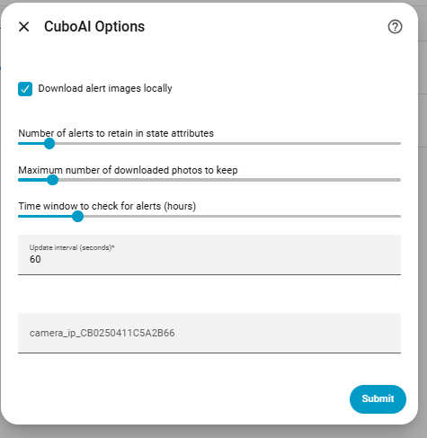
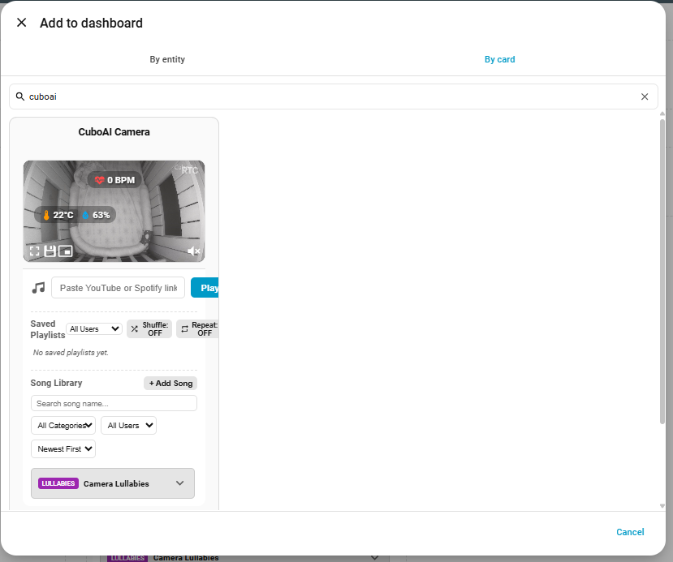
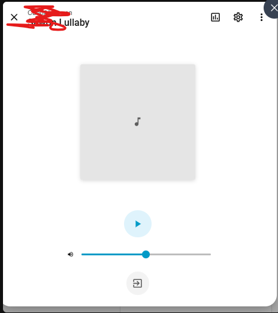
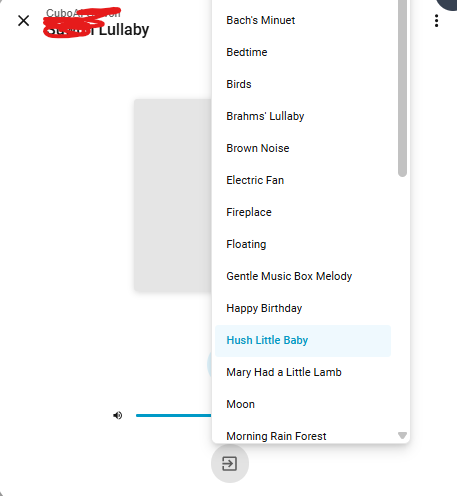

# 🍼 CuboAI Home Assistant Integration

[](https://github.com/niruse/cuboai/actions/workflows/ci.yml)
[](https://codecov.io/gh/niruse/cuboai)
[](https://github.com/hacs/integration)

Bring your CuboAI baby monitor into Home Assistant!  
Monitor alerts, camera status, subscription, and more—directly in your smart home dashboard.

---

## ☕ Support

If you found this project helpful, you can [buy me a coffee](https://coff.ee/niruse)!

---

## 🚨 Disclaimer

> **Warning:**  
> This is an unofficial integration.  
> You are fully responsible for the use of your credentials and your data.  
> The author and contributors take no responsibility for any issues, account restrictions, or data loss that may occur.  
>  
> Use at your own risk.

---

## ✨ Features

This integration provides a massive suite of local control and real-time monitoring entities for your CuboAI cameras! 

### 🎛️ Controls
- **Night Light Brightness**: Native Home Assistant brightness slider (1% - 100%)
- **Night Light Switch**: Toggle the night light on/off
- **Lullaby Player**: Media player to start, stop, and select lullabies
- **Lullaby Timer**: Set the duration for lullabies to play
- **Speaker Play Time**: Adjust how long the speaker stays active
- **Flip Screen**: Toggle the camera's physical video orientation
- **Night Vision**: Switch between Auto, On, and Off
- **Sleep Mode**: Put the camera into privacy sleep mode
- **Status LED**: Toggle the physical status indicator LED
- **Baby Presence**: Toggle baby presence tracking

### 📊 Live Sensors
- **Baby Info**: Demographics (Name, Age, etc.)
- **Camera State**: Online/Offline/Streaming status
- **Detection Statuses**: Cry Detection, Cough Detection, Sleep Safety (Face Covered/Rollover)
- **Cry Sensitivity**: Current sensitivity level for cry detection
- **Temperature & Humidity**: Real-time environmental readings
- **Temperature & Humidity Alerts**: High/Low thresholds configured in the app
- **Sleep Sensor Pad (Mat)**: Live BPM (Heart Rate) and Mat Battery/State
- **Thermometer**: Live reading and battery state of the external thermometer
- **Last Alert**: Image thumbnail and time of the last captured event
- **Firmware Version**: The active firmware installed on the camera
- **WebRTC Stream**: Raw stream ID for embedding ultra-low latency go2rtc video

### 🛠️ Diagnostics
- **WiFi Diagnostics**: Signal strength (RSSI), Quality (%), Noise, Channel, and SSID
- **Network Info**: Local IP Address and MAC Address
- **Connection Details**: Connection Mode (LAN vs P2P) and Connected Users count
- **Hardware Info**: Camera Stand Type and Session History

### 🌟 Plus:
- **Zero-Delay Local Streaming**: Video is fetched directly from the camera on your local network!
- **Multi-Camera Support**: Add as many CuboAI cameras as you own!
- **Secure Authentication**: Uses native AWS Cognito SRP authentication.

---

## 🛠️ Installation

### ⚠️ Requirements
Before installing CuboAI, you **must** install the **WebRTC Camera** custom component by AlexxIT (available in HACS). This provides the underlying ultra-low latency WebRTC streaming engine that this integration hooks into!

---

### 📦 Installation via HACS

1. Go to **HACS** in Home Assistant.
2. Click the **three dots menu** (⋮) > **Custom repositories**.
3. Add this repository URL:  
   `https://github.com/niruse/cuboai`
4. In the **Category** dropdown, select **Integration**.
5. Click **Add**.<br>
   
6. Search for **CuboAI** in HACS and click **Install**.
7. **Restart Home Assistant** to complete the installation.

---

### 📁 Manual Installation

1. Download the `cuboai` folder from this repository
2. Place it in `/config/custom_components/` on your Home Assistant instance
3. Restart Home Assistant

---

### ⚙️ Configuration & Settings

After adding the integration, you can click on **Configure** at any time to tweak its behavior. 
These settings can be changed seamlessly without needing to log out or remove the integration!



You can adjust:
- **Download Images:** Toggle whether to save event thumbnails locally.
- **Alerts Count:** How many recent alerts to track in the sensor.
- **Max Saved Photos:** The maximum number of images to keep on disk.
- **Hours Back:** How far back in time to fetch alerts on startup.
- **Update Interval:** How often to poll the API for changes.
- **Camera IP (Optional):** Your camera's local IP is **discovered automatically**, so you can leave this blank! You only need to manually enter the IP if your Home Assistant is on a different VLAN or complex network that prevents auto-discovery.

### ❌ Missing / Unsupported Features
While we provide a massive suite of entities, some native CuboAI app features cannot be implemented in Home Assistant currently:
- **Past Video Playback (Timeline):** Home Assistant cannot fetch or stream the historical 18-hour video timeline from the camera. Only live streaming is supported.
- **Native Two-Way Audio (Without Custom Card):** Home Assistant's default WebRTC implementation does not natively support microphone backchannel audio without using our provided `cuboai-card.js` Custom Lovelace card.
- **Pan / Tilt:** The CuboAI camera is fixed and does not physically support PTZ (Pan-Tilt-Zoom).

---

## Sample Images of Sensors

Here are example screenshots from the CuboAI integration:

### Last 5 Alerts Sensor Card


### Camera State & Subscription Status


## Baby Info


## 🖥️ Example Lovelace Dashboard

Below is a sample of how you might present the alerts in a Markdown card, including event images:


> 💡 Replace `{{Your Baby Name}}` with the actual entity suffix (e.g., `john`).

```yaml
type: markdown
title: 🍼 CuboAI Last 5 Alerts
content: >
  

  

  | Type | Time | Image |

  |------|------|-------|

  

  | **{{ alert['type'].replace('CUBO_ALERT_','').replace('_',' ').title() }}**
  | 
    {{ as_timestamp(alert['created']) | timestamp_custom('%Y-%m-%d %H:%M', true) }} | 
    - |
  

  

  _No recent alerts_

  

```
---

## 🎨 CuboAI Custom Lovelace Card (Recommended!)

For the absolute best experience, we provide a **Custom Lovelace Card** (`cuboai-card.js`) that automatically wraps the WebRTC Camera card and provides a fully native app-like experience directly in Home Assistant!



### ✨ Features:
- **Live Environmental Overlays**: Real-time Temperature & Humidity floating directly over the video feed!
- **Baby Vitals**: Live BPM (Heart Rate) overlay directly on the video if you have the Sleep Sensor Pad!
- **Smart Fallback**: Automatically leverages the camera entity to enable fallback to MSE/HLS when you are outside your home network (so video always plays flawlessly over Home Assistant Cloud / Nabu Casa)!
- **Advanced Lullaby Player**: A dynamic, sliding drawer menu to manage lullabies and speaker logic natively:
  - **Sources**: Play songs directly from **YouTube**, or use **Spotify** links (currently in testing mode).
  - **Library Management**: Create custom playlists, add your own songs, and use the built-in search logic to find tracks easily.
  - **Playback Control**: Manage play time filters and the underlying speaker logic intuitively from the UI.
  
  <p float="left">
    
    
  </p>

### 🛠️ Installing the Custom Card

To use the custom card, you must first install the **WebRTC Camera** custom card (by AlexxIT) from HACS, as our card uses it under the hood for ultra-low latency video.

1. **Install WebRTC Camera:** Go to HACS -> Frontend -> Search for "WebRTC Camera" and install it.
2. **Add CuboAI Card Resource:** 
   - Navigate to **Settings** -> **Dashboards** -> **Resources** (You may need to click the 3 dots in the top right to see Resources).
   - Click **Add Resource**.
   - Set the URL to: `/local/cuboai-card.js?v=1`
   - Set the Resource Type to: **JavaScript Module**.
   - Click **Create**!
3. **Important Cache Note:** If you ever update the integration, change the version number (e.g., `?v=2`) in the Resources menu to force Home Assistant to load the newest code!

### 💻 Using the Card in your Dashboard

Go to your dashboard, click "Edit Dashboard", add a "Manual" card, and paste the following YAML. Provide your camera's internal `device_id` to link all of its sensors automatically!

```yaml
type: custom:cuboai-camera-card
device_id: {cubo_id}
default_mute_state: unmuted
```

The card will automatically detect all the related sensors (temperature, humidity, lullaby, etc.) using your camera's device ID and seamlessly link them all together!

### 📱 Using the Custom Features
Once the card is on your dashboard, you have full control over the camera directly from the video feed:
- **Night Light:** Tap on the Night Light icon overlay to instantly toggle the camera's physical night light on or over.
- **Lullabies:** Click the music note icon to open the sliding Lullaby drawer. You can select a song, adjust the timer, and play/pause the music natively. 
- **Instant Syncing:** Because this hooks directly into the Home Assistant entities, any action you take (like turning on a lullaby) will **instantly synchronize across all devices**. If you play a lullaby on your iPad, your phone's dashboard will immediately reflect that the lullaby is playing!

---

## 🛠️ Troubleshooting

If you are experiencing issues (such as sensors showing as "Unknown" or the configuration flow hanging), you can easily capture diagnostic logs:
1. Go to **Settings > Devices & Services > CuboAI > Configure**
2. Check the **"Enable Debug Logging to File"** box.
3. Wait 30-60 seconds for the integration to attempt a connection.
4. Open your Home Assistant `config` folder and look for `cuboai_debug.log`. This file will contain all the necessary traces and error messages.

*Note: Logs are capped at 2MB per file to prevent disk space issues.*

### 🔌 Streaming ports & conflicts

The integration runs its own internal go2rtc server for local streaming. It uses these TCP ports by default, and **self-heals automatically** when one is already taken (for example by Home Assistant's built-in go2rtc or the WebRTC Camera add-on):

| Port | Purpose | If already in use |
|------|---------|-------------------|
| `8555` | RTSP listener (camera stream) | Hops to the next free port (usually `8557`) |
| `1985` | go2rtc API (snapshots, card, WebRTC) | Hops to the next free port (usually `1986`) |
| `8556` | WebRTC listener | Hops to the next free port |

You never need to configure anything for this: the camera entity, sensors, and the custom card all discover the effective ports through the `rtsp_port` attribute and internal state. A log line like `go2rtc API port 1985 is already in use by another process — using port 1986 instead` is informational, not an error.

Additional protections (since v2.4.4):

- **Orphaned go2rtc cleanup**: if a previous go2rtc process survived a hard Home Assistant crash and still holds the ports, the integration detects it (by its `cuboai_*` streams) and terminates it on startup, reclaiming the standard ports.
- **No retry storms**: if the internal go2rtc could not start at all, camera entities stop offering stream sources and live snapshots instead of hammering a port that may belong to another process (which previously caused an endless `Using native library` loop and resource exhaustion — see issue [#84](https://github.com/niruse/cuboai/issues/84)).

---

## 📝 Changelog

See the [CHANGELOG.md](CHANGELOG.md) file for a detailed history of updates, bug fixes, and improvements.

---

## 💖 Credits & Special Thanks

Massive thanks to [Fredrick (Fredde87)](https://github.com/Fredde87/cuboai-tutk) for his incredible reverse-engineering work and for providing the TUTK Kalay P2P protocol implementations that make the local streaming functionality of this integration possible!

---

## 🤝 Contributing

We welcome:
- 🔧 Bug fixes
- 🌟 Features
- 🧠 Suggestions

Submit a PR or [open an issue](https://github.com/niruse/cuboai/issues)
