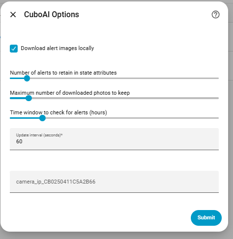
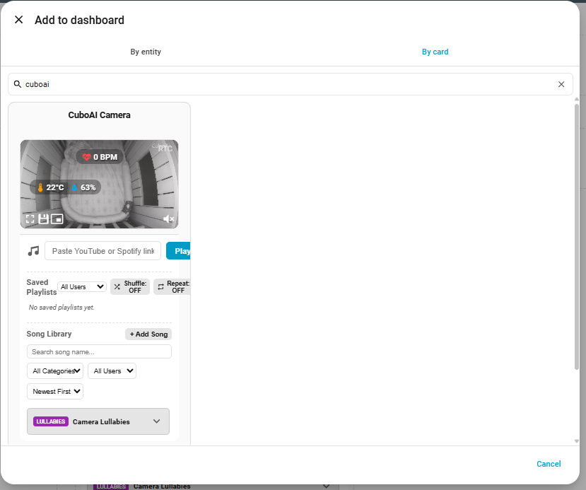
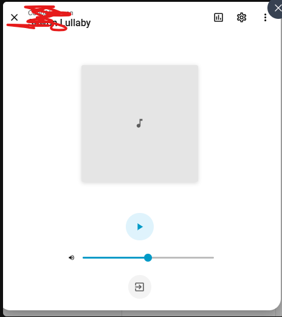
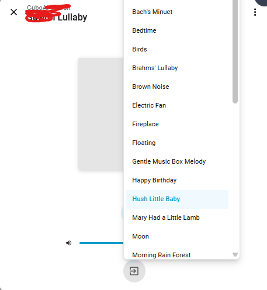

# 🍼 CuboAI Home Assistant Integration

[](https://github.com/niruse/cuboai/actions/workflows/ci.yml)
[](https://codecov.io/gh/niruse/cuboai)
[](https://github.com/hacs/integration)

Bring your CuboAI baby monitor into Home Assistant!  
Monitor alerts, camera status, subscription, and more—directly in your smart home dashboard.

---

## ☕ Support

If you found this project helpful, you can [buy me a coffee](https://coff.ee/niruse)!

---

## 🚨 Disclaimer

> **Warning:**  
> This is an unofficial integration.  
> You are fully responsible for the use of your credentials and your data.  
> The author and contributors take no responsibility for any issues, account restrictions, or data loss that may occur.  
>  
> Use at your own risk.

---

## ✨ Features

This integration provides a massive suite of local control and real-time monitoring entities for your CuboAI cameras! 

### 🎛️ Controls
- **Night Light Brightness**: Native Home Assistant brightness slider (1% - 100%)
- **Night Light Switch**: Toggle the night light on/off
- **Lullaby Player**: Media player to start, stop, and select lullabies
- **Lullaby Timer**: Set the duration for lullabies to play
- **Speaker Play Time**: Adjust how long the speaker stays active
- **Flip Screen**: Toggle the camera's physical video orientation
- **Night Vision**: Switch between Auto, On, and Off
- **Sleep Mode**: Put the camera into privacy sleep mode
- **Status LED**: Toggle the physical status indicator LED
- **Baby Presence**: Toggle baby presence tracking

### 📊 Live Sensors
- **Baby Info**: Demographics (Name, Age, etc.)
- **Camera State**: Online/Offline/Streaming status
- **Detection Statuses**: Cry Detection, Cough Detection, Sleep Safety (Face Covered/Rollover)
- **Cry Sensitivity**: Current sensitivity level for cry detection
- **Temperature & Humidity**: Real-time environmental readings
- **Temperature & Humidity Alerts**: High/Low thresholds configured in the app
- **Sleep Sensor Pad (Mat)**: Live BPM (Heart Rate) and Mat Battery/State
- **Thermometer**: Live reading and battery state of the external thermometer
- **Last Alert**: Image thumbnail and time of the last captured event
- **Firmware Version**: The active firmware installed on the camera
- **WebRTC Stream**: Raw stream ID for embedding ultra-low latency go2rtc video

### 🛠️ Diagnostics
- **WiFi Diagnostics**: Signal strength (RSSI), Quality (%), Noise, Channel, and SSID
- **Network Info**: Local IP Address and MAC Address
- **Connection Details**: Connection Mode (LAN vs P2P) and Connected Users count
- **Hardware Info**: Camera Stand Type and Session History

### 🌟 Plus:
- **Zero-Delay Local Streaming**: Video is fetched directly from the camera on your local network!
- **Multi-Camera Support**: Add as many CuboAI cameras as you own!
- **Secure Authentication**: Uses native AWS Cognito SRP authentication.

---

## 🛠️ Installation

### ⚠️ Requirements
Before installing CuboAI, you **must** install the **WebRTC Camera** custom component by AlexxIT (available in HACS). This provides the underlying ultra-low latency WebRTC streaming engine that this integration hooks into!

---

### 📦 Installation via HACS

1. Go to **HACS** in Home Assistant.
2. Click the **three dots menu** (⋮) > **Custom repositories**.
3. Add this repository URL:  
   `https://github.com/niruse/cuboai`
4. In the **Category** dropdown, select **Integration**.
5. Click **Add**.<br>
   
6. Search for **CuboAI** in HACS and click **Install**.
7. **Restart Home Assistant** to complete the installation.

---

### 📁 Manual Installation

1. Download the `cuboai` folder from this repository
2. Place it in `/config/custom_components/` on your Home Assistant instance
3. Restart Home Assistant

---

### ⚙️ Configuration & Settings

After adding the integration, you can click on **Configure** at any time to tweak its behavior. 
These settings can be changed seamlessly without needing to log out or remove the integration!



You can adjust:
- **Download Images:** Toggle whether to save event thumbnails locally.
- **Alerts Count:** How many recent alerts to track in the sensor.
- **Max Saved Photos:** The maximum number of images to keep on disk.
- **Hours Back:** How far back in time to fetch alerts on startup.
- **Update Interval:** How often to poll the API for changes.
- **Camera IP (Optional):** Your camera's local IP is **discovered automatically**, so you can leave this blank! You only need to manually enter the IP if your Home Assistant is on a different VLAN or complex network that prevents auto-discovery.

### ❌ Missing / Unsupported Features
While we provide a massive suite of entities, some native CuboAI app features cannot be implemented in Home Assistant currently:

> **Past video playback is no longer on this list.** It moved to a supported feature in **2.5.0** — see [Recorded Playback](#-recorded-playback-on-camera-dvr). Retention is roughly two days rather than the 18 hours previously stated here; measured on a real camera, 48 h back returns footage and 56 h does not, and it varies with the SD card and how much motion there was.

- **Sleep reports (Total Sleep, Wake-ups, Longest Sleep, the routine chart):** CuboAI keeps these behind its paid tier — the app itself renders them as *"Report Preview — Activate Ultimate to see more"* — so the integration cannot fetch them either. The dashboard in this repo computes comparable figures locally from the camera's own DVR history instead.
- **Body temperature history:** only available while a compatible thermometer is paired and reporting.
- **Native Two-Way Audio (Without Custom Card):** Home Assistant's default WebRTC implementation does not natively support microphone backchannel audio without using our provided `cuboai-card.js` Custom Lovelace card.
- **Pan / Tilt:** The CuboAI camera is fixed and does not physically support PTZ (Pan-Tilt-Zoom).

---

## Sample Images of Sensors

Here are example screenshots from the CuboAI integration:

### Last 5 Alerts Sensor Card


### Camera State & Subscription Status


## Baby Info


## 🖥️ Example Lovelace Dashboard

Below is a sample of how you might present the alerts in a Markdown card, including event images:


> 💡 Replace `{{Your Baby Name}}` with the actual entity suffix (e.g., `john`).

```yaml
type: markdown
title: 🍼 CuboAI Last 5 Alerts
content: >
  

  

  | Type | Time | Image |

  |------|------|-------|

  

  | **{{ alert['type'].replace('CUBO_ALERT_','').replace('_',' ').title() }}**
  | 
    {{ as_timestamp(alert['created']) | timestamp_custom('%Y-%m-%d %H:%M', true) }} | 
    - |
  

  

  _No recent alerts_

  

```
---

## 🎨 CuboAI Custom Lovelace Card (Recommended!)

For the absolute best experience, we provide a **Custom Lovelace Card** (`cuboai-card.js`) that automatically wraps the WebRTC Camera card and provides a fully native app-like experience directly in Home Assistant!



### ✨ Features:
- **Live Environmental Overlays**: Real-time Temperature & Humidity floating directly over the video feed!
- **Baby Vitals**: Live BPM (Heart Rate) overlay directly on the video if you have the Sleep Sensor Pad!
- **Smart Fallback**: Automatically leverages the camera entity to enable fallback to MSE/HLS when you are outside your home network (so video always plays flawlessly over Home Assistant Cloud / Nabu Casa)!
- **Advanced Lullaby Player**: A dynamic, sliding drawer menu to manage lullabies and speaker logic natively:
  - **Sources**: Play songs directly from **YouTube**, or use **Spotify** links (currently in testing mode).
  - **Library Management**: Create custom playlists, add your own songs, and use the built-in search logic to find tracks easily.
  - **Playback Control**: Manage play time filters and the underlying speaker logic intuitively from the UI.
  
  <p float="left">
    
    
  </p>

### 🛠️ Installing the Custom Card

To use the custom card, you must first install the **WebRTC Camera** custom card (by AlexxIT) from HACS, as our card uses it under the hood for ultra-low latency video.

1. **Install WebRTC Camera:** Go to HACS -> Frontend -> Search for "WebRTC Camera" and install it.
2. **Add CuboAI Card Resource:** 
   - Navigate to **Settings** -> **Dashboards** -> **Resources** (You may need to click the 3 dots in the top right to see Resources).
   - Click **Add Resource**.
   - Set the URL to: `/local/cuboai-card.js?v=1`
   - Set the Resource Type to: **JavaScript Module**.
   - Click **Create**!
3. **Important Cache Note:** If you ever update the integration, change the version number (e.g., `?v=2`) in the Resources menu to force Home Assistant to load the newest code!

### 💻 Using the Card in your Dashboard

Go to your dashboard, click "Edit Dashboard", add a "Manual" card, and paste the following YAML. Provide your camera's internal `device_id` to link all of its sensors automatically!

```yaml
type: custom:cuboai-camera-card
device_id: {cubo_id}
default_mute_state: unmuted
```

The card will automatically detect all the related sensors (temperature, humidity, lullaby, etc.) using your camera's device ID and seamlessly link them all together!

### 📱 Using the Custom Features
Once the card is on your dashboard, you have full control over the camera directly from the video feed:
- **Night Light:** Tap on the Night Light icon overlay to instantly toggle the camera's physical night light on or over.
- **Lullabies:** Click the music note icon to open the sliding Lullaby drawer. You can select a song, adjust the timer, and play/pause the music natively. 
- **Instant Syncing:** Because this hooks directly into the Home Assistant entities, any action you take (like turning on a lullaby) will **instantly synchronize across all devices**. If you play a lullaby on your iPad, your phone's dashboard will immediately reflect that the lullaby is playing!

---

## ⏪ Recorded Playback (on-camera DVR)

The camera records to its own storage. This integration can play that footage
back **inside the card you already have** — no cloud subscription, and no second
card on your dashboard.

Retention is roughly **two days**, but it varies with the SD card and how much
motion there was. Measured on one camera, one request an hour: 48 h back
returned footage, 56 h did not. Requests older than the bar's span are refused
with a message rather than left to time out.

### Using it

A scrub bar sits under the picture, with a time field and fine-adjust buttons:

```
Live                                            ● LIVE
────────┬────────┬────────┬────────┬────────┬────────
      Wed 18   Thu 00   Thu 06   Thu 12   Thu 18
                    ▲ drag
[ 06/08/2026 02:00:00 ]                         [ Go ]
[  -1m  ][  -10s  ][  +10s  ][  +1m  ]
```

| Control | For |
|---|---|
| **The bar** | The rough moment. Two days across a phone is about 8 minutes per pixel. |
| **Time field + Go** | An exact date, hour and minute. |
| **−1m / −10s / +10s / +1m** | Seconds. iOS renders `datetime-local` as a wheel with no seconds whatever `step` says, so these exist on every platform. Taps are debounced, so four taps are one seek. |
| **● LIVE** | Back to the live stream. |

Releasing the playhead plays 15 minutes from that point, in the same card. The
picture switches back to live when you press LIVE.

### Card options

```yaml
type: custom:cuboai-camera-card
# Everything below is optional.
show_timeline: true          # false hides the scrub bar entirely
timeline_hours: 48           # span of the bar; match your camera's retention
timeline_play_seconds: 900   # how much footage one request plays
```

### The service

Playback is also a service, so automations and scripts can use it:

```yaml
service: cuboai.play_recording
data:
  device_id: CB02XXXXXXXXXXXX
  start_time: "10m"          # "90s", "10m", "2h", "3d" — or an absolute time
  duration: 900
```

`start_time` accepts a relative amount ago or an absolute date/time. A naive
string like `2026-08-06 02:00:00` is read in **your** timezone.

```yaml
# Show the last ten minutes on a wall tablet when the doorbell rings.
automation:
  - alias: Rewind the nursery on doorbell
    triggers:
      - trigger: state
        entity_id: binary_sensor.doorbell
        to: "on"
    actions:
      - action: cuboai.play_recording
        data:
          device_id: CB02XXXXXXXXXXXX
          start_time: "10m"
          duration: 600
```

A second camera entity, `camera.<baby>_recording`, carries the playback stream.
You do **not** need to put it on a dashboard — the card drives it for you. It
idles with no picture until something asks for a moment.

---

## 📈 Sleep windows and the timeline chart

CuboAI keeps Total Sleep, Wake-ups, Longest Sleep and the sleep-routine chart
behind its paid tier — the app renders them as *"Report Preview — Activate
Ultimate to see more"*. This integration cannot fetch them either.

What the camera **does** give away for free is its DVR history, including
`baby_present`. Recorded by Home Assistant, that supports a comparable set of
figures, computed locally.

### The timeline card

`history-graph` gives every entity its own strip and its own axis, so you
cannot see that a noise spike and the baby leaving the crib were the same
moment. This card puts every row on **one shared axis**:

```yaml
type: custom:cuboai-timeline-card
title: Last night
from: "19:00"        # a clock window; `to` at or before `from` spans midnight
to: "07:00"
rows:
  - entity: sensor.cuboai_mia_cuboai_baby_present_mia
    label: In crib
    icon: mdi:sleep
    match: in crib
    color: "#2a9d8f"
  - entity: sensor.cuboai_mia_cuboai_baby_present_mia
    label: Not in crib
    icon: mdi:baby-carriage
    match: ["not in crib", "0"]     # a list matches any of them
    color: "#e9c46a"
  - entity: sensor.cuboai_mia_cuboai_noise_level_mia
    label: Noise over 26
    icon: mdi:volume-high
    above: 26                       # numeric rows use a threshold
    color: "#5e5ce6"
```

| Option | Meaning |
|---|---|
| `from` / `to` | A clock window. Always the most recently **started** one, so a Night card keeps showing last night all through the next day. An unfinished window keeps its full width and fetches only up to now. |
| `days: 7` | A multi-day span ending now. Marks switch to one per day past 48 h. |
| `hours: 14` | The last N hours ending now. |
| `match` | A state string, or a list of them. |
| `above` | For numeric sensors: shade wherever the value is at or above this. |

Tap a bar for what it is and how long it lasted; tap a row's icon to open that
sensor. Each lane's share of the window is shown in the legend — that number is
what makes one period visibly different from another.

Two behaviours worth knowing: `unavailable` and `unknown` are **never** drawn as
a negative reading (the difference between "not in the crib" and "no idea"), and
a span runs from a matching reading to the next reading of any kind, so gaps are
not swallowed into one long block.

### The figures

`packages/cuboai_sleep.yaml` in this repo builds the same four metrics for
three windows using Home Assistant's built-in `history_stats`:

| Metric | Night 19:00–07:00 | Day 07:00–19:00 | Week |
|---|---|---|---|
| Time in crib | ✅ | ✅ | ✅ |
| Time not in crib | ✅ | ✅ | ✅ |
| Number of sleeps | ✅ | ✅ | ✅ |
| Time the sensor said nothing | ✅ | ✅ | ✅ |

Plus, for the week, an average day and a **coverage** percentage saying how much
of the total to believe.

Two things it is careful about, both learned the hard way:

- **It matches state strings, not raw numbers.** The sensor reports the
  library's phrase where it has one, so `1` surfaces as `in crib` and `2` as
  `not in crib`. Matching `"1"` silently measures nothing.
- **`0` is treated as "not in the crib".** What `0` means is not documented
  upstream — only 1 and 2 are — but it holds steady while a room is empty.
  It is *not* treated as "the camera said nothing": those readings arrive fresh
  and available. Genuine blindness is `unavailable`/`unknown` and is measured
  separately, so an empty room is never reported as camera downtime. Note that a
  Home Assistant restart also makes entities unavailable, so restarts count
  toward it.

---

### Screenshots

<!--
  TODO: drop the PNGs into docs/images/ and uncomment the block below.
  These have to be taken on a running install; they are not in the repo yet.
    dashboard-live.png      Live tab: camera + scrub bar + time picker + nudges
    dashboard-night.png     Nighttime tab: the four figures + the timeline
    dashboard-summary.png   Summary tab: week figures + coverage + 7-day chart
    dashboard-alerts.png    Alerts tab: latest alert + thumbnails
  Taken on a phone at ~390px wide, since that is where the layout matters most.


-->

## 🗂️ Installing the full dashboard

The repo ships a five-tab dashboard — **Live · Nighttime · Daytime · Summary ·
Alerts** — as a worked example.

> **The example uses the entity IDs of a camera named `mia`.** Yours will differ.
> Open Developer Tools → States, filter for `cuboai`, and replace `mia`
> throughout both files with your own. Nothing will render until you do.

**1. Copy both files into your config.**

```bash
# from the repo
cp dashboards/cuboai.yaml            /config/dashboards/cuboai.yaml
cp dashboards/packages/cuboai_sleep.yaml /config/packages/cuboai_sleep.yaml
```

**2. Enable packages** (skip if you already have them) in `configuration.yaml`:

```yaml
homeassistant:
  packages: !include_dir_named packages
```

**3. Register the dashboard** in `configuration.yaml`:

```yaml
lovelace:
  dashboards:
    cuboai-dashboard:
      mode: yaml
      title: CuboAI
      icon: mdi:baby-face-outline
      show_in_sidebar: true
      filename: dashboards/cuboai.yaml
```

**4. Check the config before restarting** — Developer Tools → YAML → *Check
configuration*, or:

```bash
ha core check
```

**5. Restart Home Assistant.** A restart is required: packages and YAML
dashboards are only read at startup.

**6. Hard-refresh the browser** (Ctrl+Shift+R, or force-close the Companion
app). The card is cached, and a stale copy is the most common reason a change
appears not to have landed.

### What each tab holds

| Tab | Contents |
|---|---|
| **Live** | The camera card with the scrub bar, current temperature / humidity / noise, presence, and the controls. |
| **Nighttime** | 19:00–07:00: the four figures, and the timeline for that window. |
| **Daytime** | 07:00–19:00: the same four figures, same lanes. |
| **Summary** | The last 7 days, plus average day and coverage. |
| **Alerts** | The latest alert, recent alerts with thumbnails, and what the camera is watching for. |

The three report tabs deliberately measure **the same things** and differ only in
the period they cover — otherwise they cannot be compared with one another.

### If a tab looks empty

- `In crib` stays at zero until the camera has actually reported someone in the
  crib. An empty room is a reading, not a fault.
- Every window also publishes how long the sensor said *nothing*. If that is
  large, the figures beside it cover only part of the window — an offline camera
  and an empty room otherwise look identical.
- The `Camera online` lane on the chart exists for the same reason.


---

## 🛠️ Troubleshooting

### Debug logs

If you are experiencing issues (stream not playing, HomeKit "No Response", sensors showing as "Unknown", the configuration flow hanging), one toggle collects everything needed for a report:

1. Go to **Settings > Devices & Services > CuboAI > Configure**
2. Check **"Enable debug logs"** and submit, then restart Home Assistant.
3. Reproduce the problem once (open the stream, wait for a sensor update, ...).
4. Collect the files below and attach the relevant ones to your issue.

| Log file | Location | What it contains |
|---|---|---|
| `cuboai_debug.log` | HA `config` folder | Every debug/info/error message from the whole integration (sensors, camera, media player, coordinator) |
| `go2rtc.log` | `config/custom_components/cuboai/bin/` | Streaming diagnostics (since v2.4.5): detected video codec (`[mpegts] muxing ...`), per-frame codec census of the first 300 frames (`FICENSUS`), fps/bitrate/loss health line every 10 s, GOP sync events, RTSP session negotiation |
| `cuboai_last_alert_debug.log` | HA `config` folder | Alert polling / image download trace |
| Home Assistant log | **Settings > System > Logs** | The integration's debug messages also appear here automatically — no `logger:` changes in `configuration.yaml` needed |

> ⚠️ **Redact before sharing:** `go2rtc.log` (like `go2rtc.yaml`) contains your cameras' `CUBOAI_UID`, `CUBOAI_ACCOUNT` and `CUBOAI_PASSWORD` values on the exec command lines — replace them with `XXX` before attaching anything to a GitHub issue.

Log files are capped at 2 MB with rotation to protect disk space. Turning the toggle off restores the quiet defaults.

### 🔌 Streaming ports & conflicts

The integration runs its own internal go2rtc server for local streaming. It uses these TCP ports by default, and **self-heals automatically** when one is already taken (for example by Home Assistant's built-in go2rtc or the WebRTC Camera add-on):

| Port | Purpose | If already in use |
|------|---------|-------------------|
| `8555` | RTSP listener (camera stream) | Hops to the next free port (usually `8557`) |
| `1985` | go2rtc API (snapshots, card, WebRTC) | Hops to the next free port (usually `1986`) |
| `8556` | WebRTC listener | Hops to the next free port |

You never need to configure anything for this. The camera entity and sensors publish the effective port they resolved, and the custom card does not deal in ports at all — it finds its camera entity by the `device_id` attribute and lets that entity supply the stream source, so whatever port go2rtc actually bound is the port that gets used. A log line like `go2rtc API port 1985 is already in use by another process — using port 1986 instead` is informational, not an error.

`8555` is normally already taken by Home Assistant's own built-in go2rtc (it is *its* WebRTC listener), so a default of `8557` in the RTSP port field is the expected outcome rather than a problem.

Additional protections (since v2.4.4):

- **Orphaned go2rtc cleanup**: if a previous go2rtc process survived a hard Home Assistant crash and still holds the ports, the integration detects it (by its `cuboai_*` streams) and terminates it on startup, reclaiming the standard ports.
- **No retry storms**: if the internal go2rtc could not start at all, camera entities stop offering stream sources and live snapshots instead of hammering a port that may belong to another process (which previously caused an endless `Using native library` loop and resource exhaustion — see issue [#84](https://github.com/niruse/cuboai/issues/84)).

---

## 📝 Changelog

See the [CHANGELOG.md](CHANGELOG.md) file for a detailed history of updates, bug fixes, and improvements.

---

## 💖 Credits & Special Thanks

Massive thanks to [Fredrick (Fredde87)](https://github.com/Fredde87/cuboai-tutk) for his incredible reverse-engineering work and for providing the TUTK Kalay P2P protocol implementations that make the local streaming functionality of this integration possible!

---

## 🤝 Contributing

We welcome:
- 🔧 Bug fixes
- 🌟 Features
- 🧠 Suggestions

Submit a PR or [open an issue](https://github.com/niruse/cuboai/issues)
