# 🍼 CuboAI Home Assistant Integration

[](https://github.com/niruse/cuboai/actions/workflows/ci.yml)
[](https://codecov.io/gh/niruse/cuboai)
[](https://github.com/hacs/integration)

Bring your CuboAI baby monitor into Home Assistant: live video with sound, recorded
playback from the camera's own storage, alerts, room and sleep-mat readings, lullabies, and
controls for the night light and camera — plus recording to an NVR and showing the camera in
UniFi Protect.

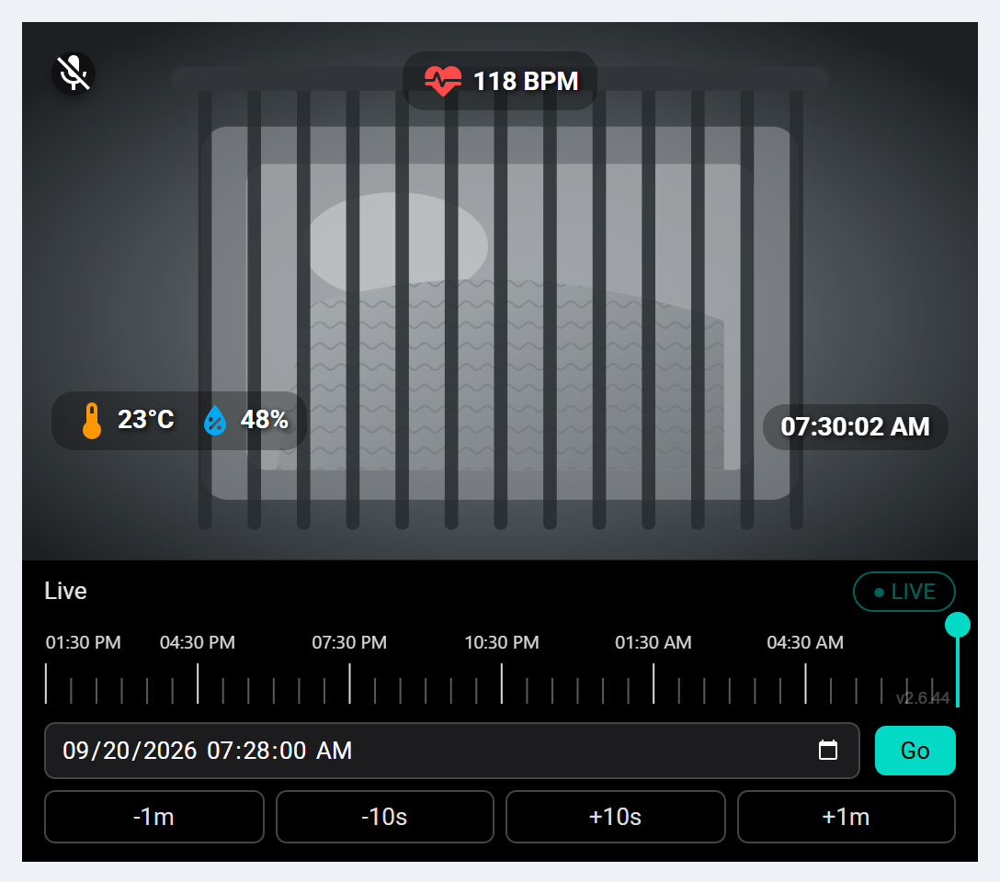

*All screenshots in this README are rendered with made-up sample data.*

---

## ☕ Support

If you found this project helpful, you can [buy me a coffee](https://coff.ee/niruse)!

## 🚨 Disclaimer

> This is an unofficial integration. You are responsible for the use of your credentials and your
> data. The author and contributors take no responsibility for any issues, account restrictions or
> data loss. Use at your own risk.

---

## ✨ Features

- **Live video, locally** — straight from the camera on your network, with a cloud-free fallback
  that also plays over Home Assistant Cloud. [The camera card](#the-camera-card)
- **Picture-in-picture** in the bundled card.
- **Talk to the room** — the card's microphone button speaks through the camera's speaker, at home
  and away. [Two-way audio](#two-way-audio)
- **Recorded playback** — scrub back through the camera's own recordings, in the same card or from
  an automation. [Recorded playback](#recorded-playback)
- **Sensors** — alerts with photos, temperature, humidity, sleep-mat BPM, thermometer, detection
  status, Wi-Fi and more. [Entities](#entities)
- **Controls** — night light and brightness, night vision, lullabies with a timer, sleep mode,
  status LED, flip, baby presence.
- **Lullabies and music** — the camera's own lullabies, or YouTube / Spotify links, with playlists.
- **Sleep timeline** — every sensor on one shared time axis. [Timeline card](#timeline-card-and-sleep-figures)
- **Record to an NVR** — Frigate, Synology, Hikvision/HiLook, Blue Iris… over RTSP.
  [RTSP](#rtsp--recording-to-an-nvr)
- **UniFi Protect** — show one or more cameras in a UniFi console. [UniFi Protect](#unifi-protect)
- **HomeKit** — an H.264 transcode for H.265 cameras (Cubo 3).
- **Several cameras and accounts**, with AWS Cognito login and two-factor authentication.

---

## 🛠️ Installation

### Requirement

Install the **WebRTC Camera** custom component by AlexxIT (HACS → search *WebRTC Camera*) first.
The CuboAI card uses it as its video player.

### With HACS

1. HACS → ⋮ → **Custom repositories**.
2. Add `https://github.com/niruse/cuboai` with category **Integration**.<br>
   
3. Search for **CuboAI**, install it, and **restart Home Assistant**.

### Manually

Copy `custom_components/cuboai` into `/config/custom_components/` and restart Home Assistant.

---

## Setup

Settings → Devices & Services → **Add Integration** → **CuboAI**.

1. **Log in** with your CuboAI account. If the account has two-factor authentication, you are asked
   for the code from your authenticator app or SMS next.
2. **Choose the cameras** to add. Every camera on the account is listed and ticked; you can change
   the choice later in Configure.
3. **First options** — alert handling, the streaming port and, optionally, UniFi Protect for your
   first camera. Everything here can be changed later in Configure.

<p float="left">
  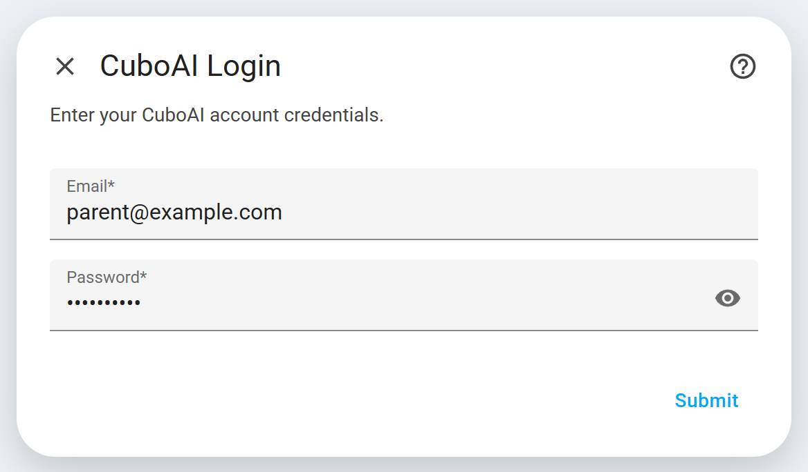
  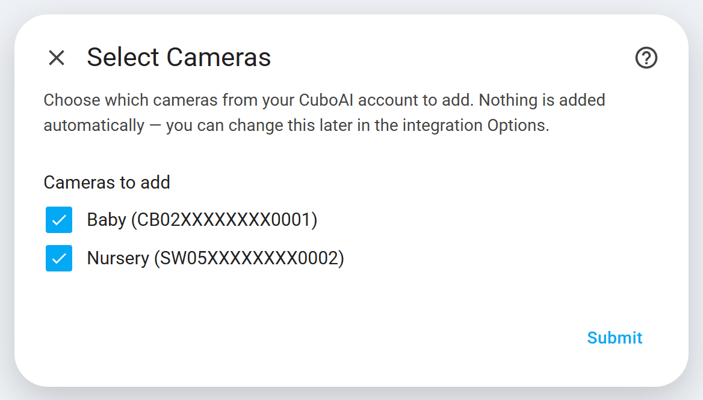
  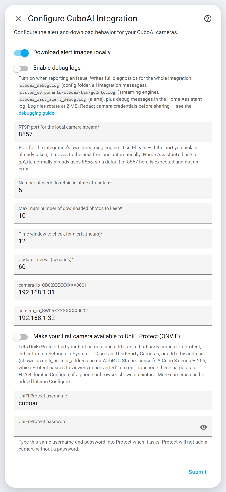
</p>

Each CuboAI account is one integration entry; add a second account the same way.

---

## Configure

Settings → Devices & Services → CuboAI → **Configure**. Saving reloads the integration; nothing
needs a re-login.

<p float="left">
  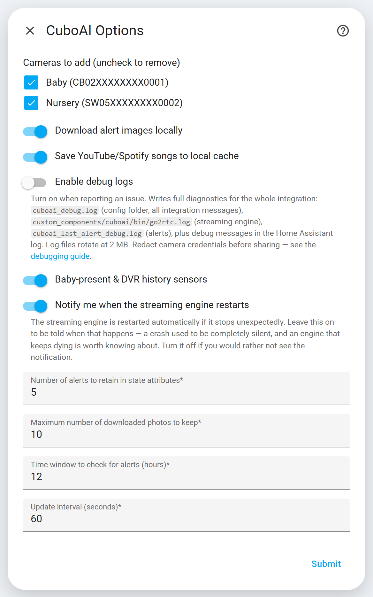
  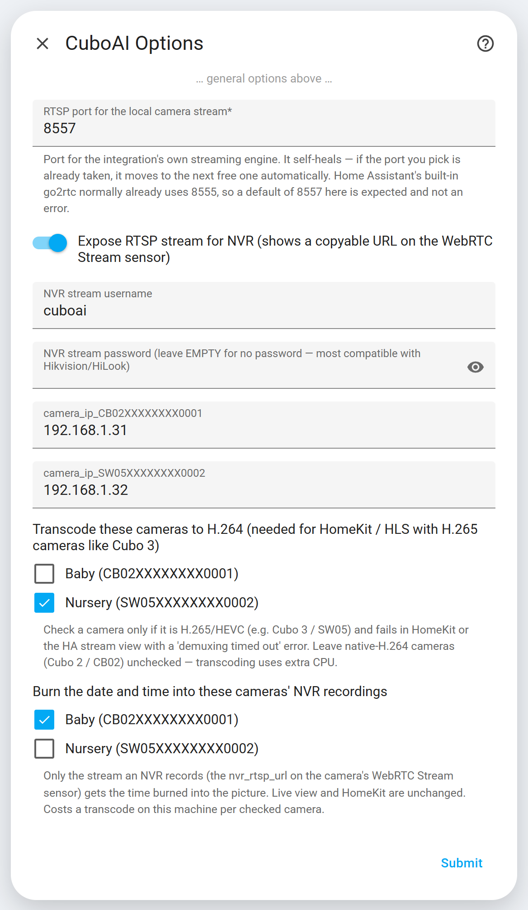
  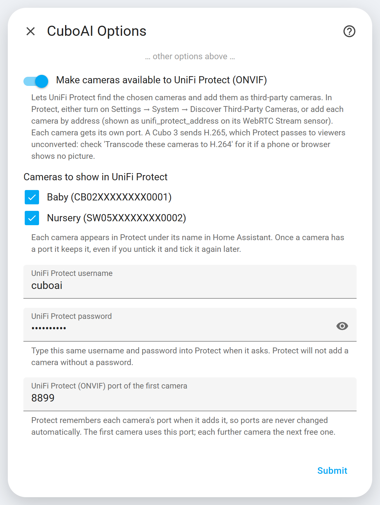
</p>

### General

| Option | Default | What it does |
|---|---|---|
| Cameras to add | all ticked at setup | Which of the account's cameras this entry manages. Unticking removes that camera's entities. |
| Download alert images locally | on | Saves each alert's photo under `www/cuboai_images/`, for the Last Alert sensor and the timeline card. |
| Save YouTube/Spotify songs to local cache | off | Keeps downloaded songs on disk so they replay instantly. Same as the *Cache YouTube/Spotify Songs* switch. |
| Enable debug logs | off | Full diagnostics for a bug report — see [Debug logs](#debug-logs). |
| Baby-present & DVR history sensors | off | Adds the [history sensors](#history-sensors-opt-in). |
| Notify me when the streaming engine restarts | on | A notification when the streaming engine crashed and was restarted, or keeps crashing. |

### Alerts and photos

| Option | Default | Range | What it does |
|---|---|---|---|
| Number of alerts to retain in state attributes | 5 | 1–50 | How many recent alerts the Last Alert sensor lists. |
| Maximum number of downloaded photos to keep | 10 | 1–100 | Photos kept on disk. Keep it at or above the alert count, or older alerts lose their thumbnails. |
| Time window to check for alerts (hours) | 12 | 1–72 | How far back alerts are fetched. |
| Update interval (seconds) | 60 | 15–300 | How often the cloud API is polled. |

### Streaming

| Option | Default | What it does |
|---|---|---|
| RTSP port for the local camera stream | first free port (usually `8557`) | Port of the integration's own streaming engine. If it is taken, the engine moves to the next free port; the port in use is always shown on the sensors. |
| `camera_ip_<device id>` (one per camera) | learned automatically | The camera's LAN address. The integration reaches the camera by a direct probe, not broadcast discovery; the address is learned after the first local connection. Set it by hand (from your router's client list) only if the local sensors and the stream stay unavailable. |
| Transcode these cameras to H.264 | none | For H.265 cameras (Cubo 3 / SW05) that fail in HomeKit or Home Assistant's own player. Uses extra CPU; leave H.264 cameras (Cubo 2 / CB02) unticked. Also available as `cuboai.set_h264_transcode` and in the card editor. |

### NVR export

| Option | Default | What it does |
|---|---|---|
| Expose RTSP stream for NVR | off | Publishes a ready-to-paste RTSP URL on the camera's WebRTC Stream sensor. See [RTSP](#rtsp--recording-to-an-nvr). |
| NVR stream username | `cuboai` | |
| NVR stream password | empty | Empty means **no authentication** (most compatible with Hikvision/HiLook, but open to your whole network). |
| Burn the date and time into these cameras' NVR recordings | none | Draws the time into the picture of the stream an NVR records. Live view and HomeKit are unchanged. Costs a transcode per ticked camera. |

### UniFi Protect

| Option | Default | What it does |
|---|---|---|
| Make cameras available to UniFi Protect (ONVIF) | off | See [UniFi Protect](#unifi-protect). |
| Cameras to show in UniFi Protect | the first camera | Each ticked camera appears in Protect separately. |
| UniFi Protect username / password | `cuboai` / — | What you type into Protect when it asks. A password is required. |
| UniFi Protect (ONVIF) port of the first camera | `8899` | Each further camera takes the next free port. Ports never change once given. |

---

## Entities

<p float="left">
  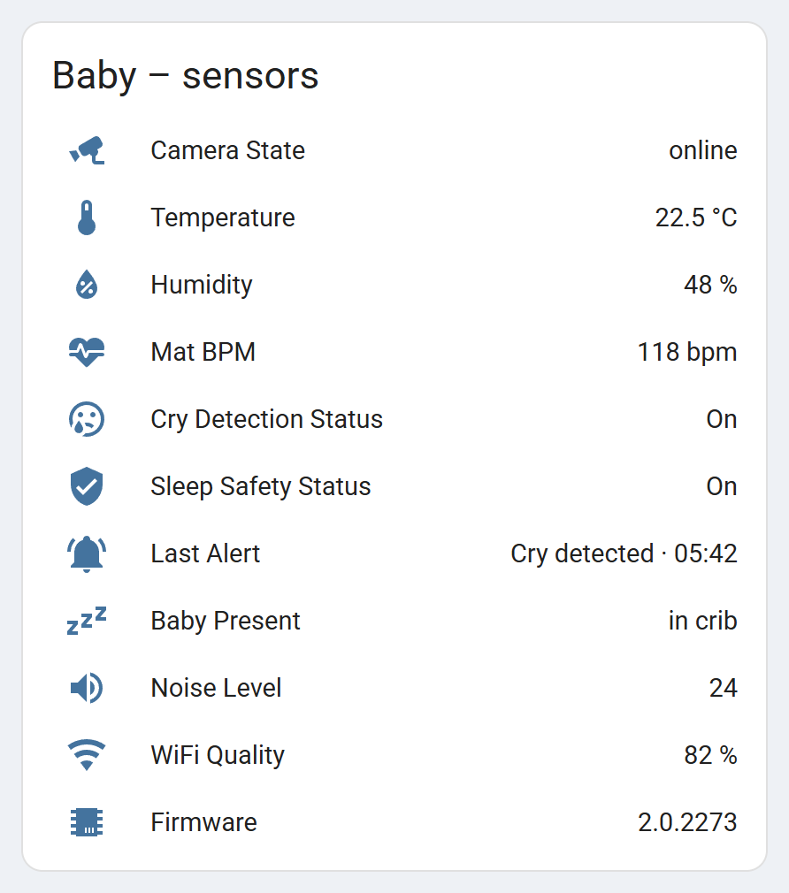
  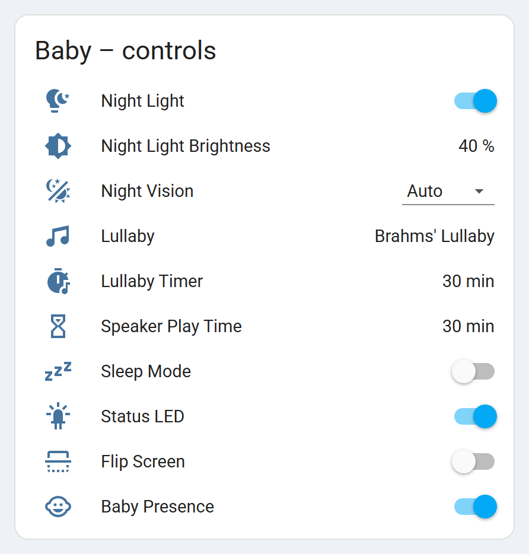
</p>

Per camera, grouped on a device named **CuboAI &lt;baby name&gt;**. Entities that talk to the
camera directly (most of them) exist once the camera's local connection details are known.

### Controls

| Entity | Type | What it does |
|---|---|---|
| Night Light | light | On/off with brightness |
| Night Light Brightness | number | 1–100 % |
| Night Vision | select | Auto / On / Off |
| Lullaby | media player | The camera's 34 built-in lullabies, white noise and nature sounds |
| Speaker | media player | Plays text-to-speech, media and YouTube/Spotify links on the camera's speaker |
| Lullaby Timer | number | 0 / 30 / 60 minutes (0 = repeat) |
| Speaker Play Time | number | 0–120 minutes, for the card's music |
| Sleep Mode | switch | Camera privacy/sleep mode |
| Status LED | switch | The camera's status light |
| Flip Screen | switch | Flips the image |
| Baby Presence | switch | Baby-presence detection on the camera |

### Sensors

| Entity | What it shows |
|---|---|
| Camera State | online / offline |
| Temperature, Humidity | Room readings |
| Temp / Humidity / Fever Alert High & Low | The alert thresholds set in the CuboAI app |
| Mat BPM, Mat State, Mat Battery | Sleep sensor pad (when present) |
| Thermometer Temperature, Thermometer Battery | Smart thermometer (when present) |
| Cry Detection Status, Cough Detection Status, Cry Sensitivity | Detection settings |
| Sleep Safety Status | Face-covered / rollover detection, with its mode |
| Last Alert | The latest alert; the `alerts` attribute lists recent ones with time and photo |
| Session History | Recent alerts as a list |
| Baby Info | Name, birth date, gender |
| Firmware | Camera firmware |
| WebRTC Stream | The live stream name, plus the RTSP / NVR / UniFi Protect addresses as attributes — see [RTSP](#rtsp--recording-to-an-nvr) |
| Last Update | When the data was last refreshed |
| Subscription | CuboAI subscription status (one per account) |
| Wi-Fi Quality, SSID, RSSI, Noise, Channel; IP and MAC Address; Connection Mode; Connected Users; Stand Type | Diagnostics |

### History sensors (opt-in)

With *Baby-present & DVR history sensors* on: **Baby Present**, **Caregiver Activity**, **Noise
Level**, **Motion** and **Privacy Mode**, read from the camera's own recording log (about a minute
behind). Each reading carries `age_seconds` and `stale`, and an entity turns unavailable rather than
show an old reading as current.

### Also

- **Camera** `camera.<baby>_local_camera` (live) and `camera.<baby>_recording` (playback — the card
  drives it; it idles until a moment is requested).
- **CuboAI Media Library** sensor (the card's songs and playlists), **Cache YouTube/Spotify Songs**
  switch and **Clear Song Cache** button, shared by all cameras.

---

## The camera card

The integration installs and registers the card itself — there is nothing to add under
Dashboards → Resources. Add it from the card picker (**CuboAI Camera**) or in YAML:

```yaml
type: custom:cuboai-camera-card
device_id: CB02XXXXXXXXXXXX   # optional with one camera
```

<p float="left">
  
  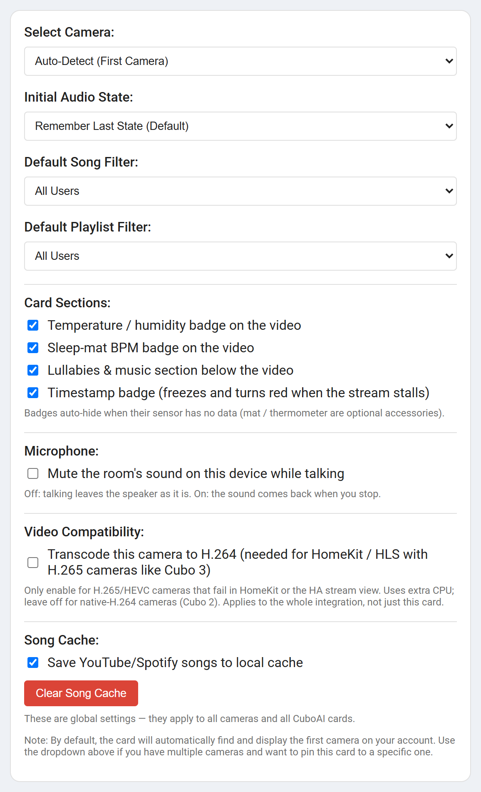
</p>

**On the video:** the sleep-mat BPM, temperature and humidity, an optional timestamp, the speaker
mute, and the microphone ([two-way audio](#two-way-audio)). Picture-in-picture works natively on
Android and Apple devices; on desktop Chrome the floating window keeps the badges. Sound plays over
WebRTC with an MSE/HLS fallback, including away from home over Home Assistant Cloud. When the
player has to change stream (your phone moves between Wi-Fi and mobile data; switching to a
recording is the exception), the last picture stays on screen with *Reconnecting…* until the new
stream's picture is showing, instead of a few seconds of black, and a player left stuck by the
network change is dialled again by itself. (On an iPhone, moving from Wi-Fi to mobile data can
still show a short black moment; mobile data to Wi-Fi is seamless.)

**Visual editor:** camera picker, initial audio state, default song and playlist filters, which
badges and sections to show, and two settings that apply to the whole integration — the H.264
transcode for this camera and the song cache (with a *Clear Song Cache* button).

### Options

| Option | Default | What it does |
|---|---|---|
| `device_id` | first camera | Pins the card to one camera. Needed with several cameras. |
| `default_mute_state` | `remember` | Sound when the card opens: `remember` (the last choice, shared across your devices), `muted` or `unmuted`. A browser that blocks sound until you tap starts muted, and the first tap brings it up |
| `default_song_filter` / `default_playlist_filter` | `all` | `all` users' songs/playlists, or only your own (`me`) |
| `show_env_overlay` | `true` | Temperature / humidity badge (hides itself without data) |
| `show_mat_overlay` | `true` | Sleep-mat BPM badge (hides itself without a mat) |
| `show_music` | `true` | The lullabies & music section |
| `show_timestamp` | `false` | Timestamp badge: the time of the frame on screen; it freezes and turns red if the live picture stalls, and shows the footage time during playback |
| `show_timeline` | `true` | The recorded-playback bar (YAML only) |
| `timeline_hours` | `18` | Span of the bar (YAML only) |
| `timeline_play_seconds` | `900` | Footage played per request (YAML only) |
| `talk_mutes_speaker` | `false` | Mute the room's sound on this device while you talk; it comes back when you stop |
| `talk_dry_run` | `false` | Microphone test mode: everything except the camera, nothing plays (YAML only) |

### Lullabies and music

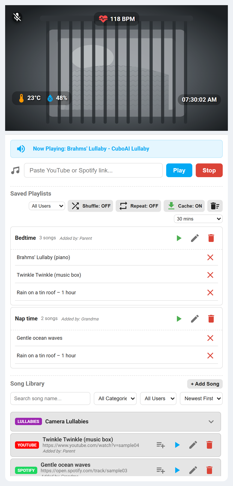

- **Play** a YouTube or Spotify link, or one of the camera's own lullabies, on the camera's speaker.
- **Song library** with search, categories, sort, and who added each song; **playlists** with
  shuffle, repeat and a play-time limit.
- The library, playlists and shuffle/repeat settings are stored in Home Assistant, so every phone
  and tablet sees the same ones.
- With the song cache on, a song downloaded once replays instantly.

### Two-way audio

Tap the microphone button (top left of the video) to talk through the camera's speaker, and tap it
again to stop. It turns amber while the camera opens its speaker (a few seconds) and red once the
camera is listening.

- The sound goes over Home Assistant's own connection, the one the dashboard already uses, so it
  works at home and away with no VPN, port or WebRTC setup.
- **Home Assistant must be opened over https.** Browsers give a web page the microphone only on a
  secure address; on a plain `http://` address the button explains this. In the Home Assistant app
  that includes the home (internal) URL. On an iPhone, allow the microphone under
  Settings › Home Assistant › Microphone.
- By default talking never changes the speaker: the room's sound on your phone stays as you and
  the card's audio setting have it (the phone's echo cancellation keeps its speaker out of the
  microphone).
- **Option: mute the room while talking** (`talk_mutes_speaker: true`, or *Mute the room's sound on
  this device while talking* in the visual editor). The sound on this phone goes off when the talk
  starts and comes back when you stop, so you don't hear yourself return from the room. If you tap
  the speaker during the talk, your choice stands. The mute is never saved and doesn't reach other
  devices. If a talk ends by itself (time limit, connection lost) and the phone won't turn the sound
  back on without a tap, the notice says *Tap 🔈 to hear the room*.
- A talk stops by itself after 2 minutes, when the app goes to the background or when the
  connection drops.
- One talker per camera: the button refuses while the camera's Speaker entity is playing a song or
  TTS, and songs and TTS are refused while someone is talking.
- Any user allowed to control the camera's Speaker entity can talk.
- To try it without a sound in the room, add `talk_dry_run: true` to the card's YAML. Everything
  runs except the camera, and the notice on the video says *TEST MODE*.

How it works, why it goes over Home Assistant's connection rather than WebRTC, and how to test it:
[docs/two-way-audio.md](docs/two-way-audio.md).

---

## Recorded playback

The camera records to its own SD card, and the card plays that footage back in place — no cloud
subscription and no second card. How far back you can go is however much the card holds, oldest
first out: typically **about two days**, or **18–20 hours** with baby-presence detection on (it
records much more).

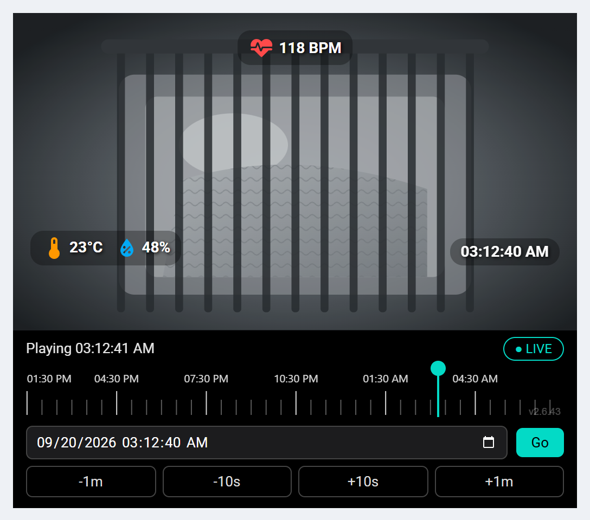

| Control | For |
|---|---|
| **The bar** | Drag to the rough moment; releasing plays from there. |
| **Date/time field + Go** | An exact moment. |
| **−1m / −10s / +10s / +1m** | Fine steps (taps are combined into one seek). |
| **● LIVE** | Back to live. |

While playing, the label shows a running timecode and the playhead moves with the footage. A moment
the camera no longer holds shows *"Nothing recorded at that moment"* and returns to live; after that
the bar shortens itself to what actually plays.

### The service

```yaml
action: cuboai.play_recording
data:
  device_id: CB02XXXXXXXXXXXX
  start_time: "10m"     # "90s", "10m", "2h", "1d" ago — or a date/time in your timezone
  duration: 600         # seconds, 5–900 (default 60)
```

The footage plays on `camera.<baby>_recording`. For example, rewind the nursery on a wall tablet
when the doorbell rings:

```yaml
automation:
  - alias: Rewind the nursery on doorbell
    triggers:
      - trigger: state
        entity_id: binary_sensor.doorbell
        to: "on"
    actions:
      - action: cuboai.play_recording
        data:
          device_id: CB02XXXXXXXXXXXX
          start_time: "10m"
          duration: 600
```

---

## Timeline card and sleep figures

CuboAI keeps its sleep reports behind a paid tier, so the integration can't fetch them. The
camera's recording log is free, though, and with the history sensors on Home Assistant can build
comparable figures locally.

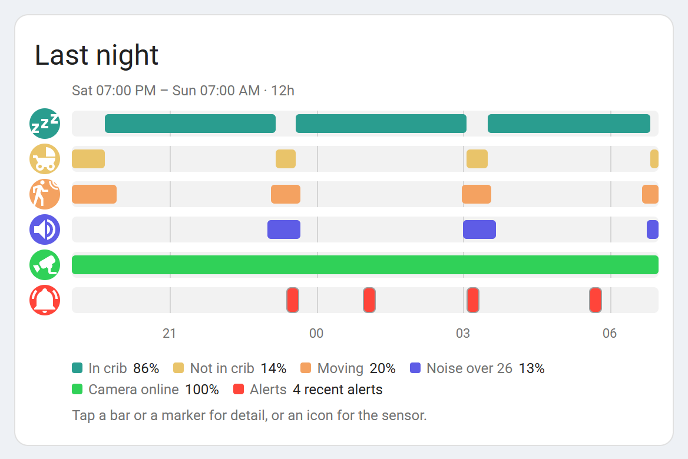

`custom:cuboai-timeline-card` puts every sensor on **one shared time axis**, so a noise spike and
the baby leaving the crib line up:

```yaml
type: custom:cuboai-timeline-card
title: Last night
from: "19:00"          # `to` at or before `from` spans midnight
to: "07:00"
rows:
  - entity: sensor.cuboai_baby_cuboai_baby_present_baby
    label: In crib
    icon: mdi:sleep
    match: in crib
    color: "#2a9d8f"
  - entity: sensor.cuboai_baby_cuboai_noise_level_baby
    label: Noise over 26
    icon: mdi:volume-high
    above: 26
    color: "#5e5ce6"
  - entity: sensor.cuboai_last_alert_baby
    label: Alerts
    icon: mdi:bell-ring
    events: alerts     # alerts are drawn as markers
    color: "#ff453a"
```

| Option | Meaning |
|---|---|
| `title` | Card title |
| `from` / `to` | A daily clock window — always the most recent one started, so a night card keeps showing last night all the next day |
| `hours` | The last N hours (default 14) |
| `days` | The last N days |
| `rows[].entity`, `label`, `icon`, `color` | One lane |
| `rows[].match` | State (or list of states) that fills the lane |
| `rows[].above` | For numeric sensors: fill where the value is at or above this |
| `rows[].events` | Attribute holding a list of alerts, drawn as markers |
| `rows[].match_type` | On an events row: only this alert type (or list), e.g. `CUBO_ALERT_CRY` |

Tap a bar or marker for details (an alert shows its photo), or a lane's icon for its sensor. The
legend shows each lane's share of the window. `unavailable` and `unknown` are never drawn as a
reading. Alert lanes can only show alerts the integration still holds — raise *Number of alerts* and
*Time window* in Configure (e.g. 20 and 24) to keep last night's alerts visible the next day.

The **figures** (time in crib, time out of crib, number of sleeps, time the sensor said nothing, for
night, day and week) come from `dashboards/packages/cuboai_sleep.yaml`, built on Home Assistant's
`history_stats`.

### The example dashboard

The repo ships a five-tab dashboard — **Live · Nighttime · Daytime · Summary · Alerts** — in
[`dashboards/`](dashboards/README.md). It uses the entity ids of a camera called `baby`; replace them
with yours as [`dashboards/README.md`](dashboards/README.md) describes, then:

1. Copy `dashboards/cuboai.yaml` to `/config/dashboards/` and `dashboards/packages/cuboai_sleep.yaml`
   to `/config/packages/`.
2. In `configuration.yaml`, enable packages and register the dashboard:

   ```yaml
   homeassistant:
     packages: !include_dir_named packages

   lovelace:
     dashboards:
       cuboai-dashboard:
         mode: yaml
         title: CuboAI
         icon: mdi:baby-face-outline
         show_in_sidebar: true
         filename: dashboards/cuboai.yaml
   ```
3. Check the configuration, restart Home Assistant, and hard-refresh the browser.

| Tab | Contents |
|---|---|
| Live | The camera card, room readings, presence and controls |
| Nighttime / Daytime | 19:00–07:00 / 07:00–19:00: the figures and the timeline |
| Summary | The last 7 days, an average day and coverage |
| Alerts | The latest alert, recent alerts with photos, and detection settings |

`In crib` stays at zero until the camera has actually detected someone — which needs baby-presence
detection on (CuboAI app, or the Baby Presence switch).

<details>
<summary>A Markdown card listing the last alerts</summary>

```yaml
type: markdown
title: 🍼 Last alerts
content: >
  
  
  | Type | Time | Image |
  |------|------|-------|
  
  | **{{ alert['type'].replace('CUBO_ALERT_','').replace('_',' ').title() }}** |
  {{ as_timestamp(alert['created']) | timestamp_custom('%Y-%m-%d %H:%M', true) }} |
  - |
  
  
  _No recent alerts_
  
```

</details>

---

## RTSP — recording to an NVR

The integration's streaming engine serves each camera as a plain RTSP stream that any recorder or
player (VLC included) can use. Recording does not open a second connection to the camera.

1. **Turn it on:** Configure → **Expose RTSP stream for NVR**. Set a username and password, or leave
   the password empty for an open stream (the sensor then says `nvr_auth: none (open stream)`).
2. **Copy the URL** from the camera's **WebRTC Stream** sensor (Developer Tools → States, or the
   entity's attributes). Always copy it — the port and the stream name can differ from any example.

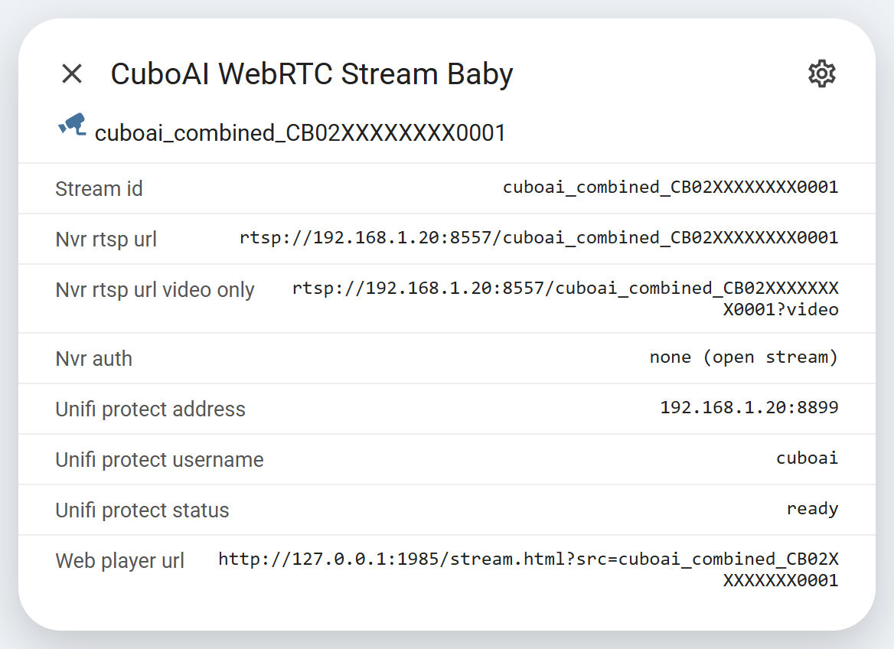

| Attribute | What it is |
|---|---|
| `nvr_rtsp_url` | **The one for your recorder**, reachable from your network, credentials included |
| `nvr_rtsp_url_video_only` | The same without the audio track (`?video`) — use it if the recorder refuses the stream or complains about audio |
| `rtsp_url` | The same stream on `127.0.0.1`, only for the Home Assistant host itself |
| `nvr_auth` | `basic`, or `none (open stream)` |
| `web_player_url` | A test page in the browser |

**Re-copy the URL after changing** the H.264 transcode or the timestamp option for that camera: the
stream name changes with them (`cuboai_combined_…`, `cuboai_h264_…`, `cuboai_stamped_…`).

| If the recorder… | Then |
|---|---|
| says 404 / stream not found, or stays offline with nothing in `go2rtc.log` | The path is wrong — re-copy `nvr_rtsp_url`, and check a recorder's separate *path* field character by character |
| gets connection refused | Wrong port, or the `127.0.0.1` URL was used from another machine |
| gets 401 | The password changed — re-copy the URL |
| connects but shows no picture of a Cubo 3 | It can't decode H.265 — turn on the H.264 transcode for that camera and re-copy |

Hikvision/HiLook settings and deeper checks: [docs/nvr-troubleshooting.md](docs/nvr-troubleshooting.md).

---

## UniFi Protect

Show CuboAI cameras in a UniFi console next to UniFi cameras. Protect talks to the integration over
ONVIF and pulls the video from its streaming engine, like an NVR.


1. Configure → **Make cameras available to UniFi Protect (ONVIF)**, tick the cameras, set a
   **password**, save. Each camera's *WebRTC Stream* sensor shows its `unifi_protect_address` (e.g.
   `192.168.1.20:8899`, the next camera `:8900`) and `unifi_protect_status: ready`.
2. Add each camera in Protect, either way:
   - **By address** (works across VLANs): Protect → *UniFi Devices* → **?** → **Try Advanced
     Adoption** → the `unifi_protect_address`, username and password.
   - **Discovery** (same network only): Protect → Settings → System → **Discover Third-Party
     Cameras** → on, then **Adopt** the camera under *UniFi Devices*.

**Good to know**

- **Names:** each camera appears as "CuboAI" plus its name in Home Assistant (your rename, else its
  CuboAI name). Protect reads the name when it adds the camera; you can rename it in Protect.
- **Codec:** Protect is told the real codec. A Cubo 2 sends H.264; a Cubo 3 sends H.265, which Protect
  passes to your phone or browser unconverted — if a viewer shows no picture, turn on *Transcode
  these cameras to H.264* for it (about one CPU core on a Raspberry Pi 5). Switching that option
  takes effect in Protect within about 20 seconds, without re-adding the camera.
- **Video only** — Protect can't play the camera's audio track.
- **Recording** needs a hard drive in the console; without one, cameras still add and live-view.
- **Ports never change** once a camera has one, because Protect remembers the address. If a port is
  taken, a notification says so and the other cameras keep working.
- Settings Protect pushes to a camera (time, encoding, reboot) are accepted and ignored.
- One CuboAI account per Home Assistant can use this (with as many of its cameras as you like).

---

## Services

| Service | Fields | What it does |
|---|---|---|
| `cuboai.play_recording` | `device_id`, `start_time`, `duration` | Plays recorded footage — see [Recorded playback](#recorded-playback) |
| `cuboai.set_h264_transcode` | `device_id`, `enabled` | Turns the H.264 transcode on or off for one camera (reloads the integration) |
| `cuboai.clear_youtube_cache` | — | Deletes the cached songs |
| `cuboai.save_custom_songs`, `cuboai.save_playlists`, `cuboai.save_settings` | — | Used by the card to store its song library, playlists and settings |

---

## Troubleshooting

### Sign-in or token renewal failed

If CuboAI rejects the saved refresh token, Home Assistant asks you to sign in
again on the integration entry under **Settings → Devices & Services**. Use the
same CuboAI account and complete two-factor authentication if enabled. Recovery
updates the existing entry, keeping its cameras, entity identities and options;
you do not need to reinstall or move files.

Tokens are now stored together in their owning Home Assistant config entry.
The old `cuboai_access_token.json` and `cuboai_refresh_token.json` files are no
longer read or updated by the integration. They are left untouched, so an old
file cannot replace tokens from a fresh sign-in. On upgrading, an account whose
latest rotated tokens were stored only in those files may need to sign in once.
Temporary network/server errors remain retryable and do not erase credentials.

### Download diagnostics (start here)

Settings → Devices & Services → CuboAI → ⋮ → **Download diagnostics**. The report is **already
redacted** — passwords, e-mails, tokens, camera ids and names are removed or replaced with aliases
like `camera_1` — so you can attach it to a GitHub issue as is. It shows, per camera, the stream in
use and its codec, who is watching, HomeKit and UniFi Protect state, and ends with plain-language
`verdicts`. Turn on debug logs and reproduce the problem first so it has more to go on.

### Debug logs

Configure → **Enable debug logs**, reproduce the problem, then collect:

| File | Where | Contains |
|---|---|---|
| `cuboai_debug.log` | Home Assistant `config` folder | Everything the integration logs |
| `go2rtc.log` | `config/custom_components/cuboai/bin/` | The streaming engine: codecs, stream health, reconnects |
| `cuboai_last_alert_debug.log` | `config` folder | Alert polling and photo downloads |
| Home Assistant log | Settings → System → Logs | The integration's messages, no `logger:` setup needed |

> ⚠️ `go2rtc.log` contains your camera credentials on its command lines — replace them with `XXX`
> before sharing. The diagnostics download does this for you.

Logs rotate at 2 MB. Turn the option off afterwards.

### Notifications

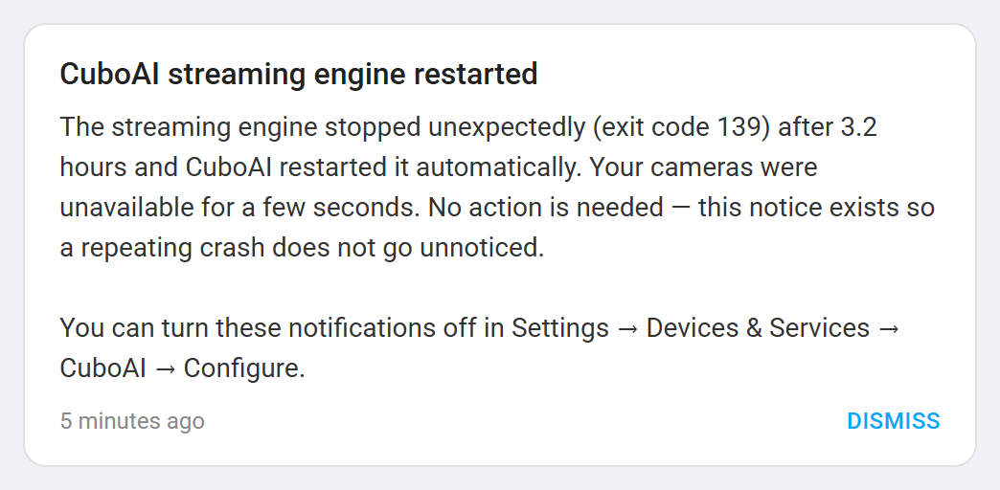

If the streaming engine stops unexpectedly it is restarted automatically and you get a notification
(switch it off in Configure). If it keeps crashing right after starting, the integration stops
restarting it and says so — check `go2rtc.log`, then reload the integration.

### Ports

The streaming engine uses RTSP `8557` (usually — it moves if a port is taken), API `1985` and
WebRTC `8556`; UniFi Protect uses `8899` and up. Nothing needs configuring; the sensors always show
the ports in use. Details: [docs/advanced.md](docs/advanced.md).

---

## Not supported

- **Sleep reports** (total sleep, wake-ups, the routine chart): behind CuboAI's paid tier. The
  [timeline card and sleep figures](#timeline-card-and-sleep-figures) compute similar ones locally.
- **Body-temperature history** — only while a compatible thermometer is paired.
- **Pan / tilt** — the camera is fixed.

---

## Changelog

See [CHANGELOG.md](CHANGELOG.md).

## Credits

Huge thanks to [Fredrick (Fredde87)](https://github.com/Fredde87/cuboai-tutk) for the reverse
engineering and the TUTK Kalay P2P implementation that make local streaming possible.

## Contributing

Bug fixes, features and ideas are welcome — open a PR or an
[issue](https://github.com/niruse/cuboai/issues). Adding a sensor for something the camera knows?
Read [docs/camera-probe.md](docs/camera-probe.md) first: how to check an endpoint returns real data,
and the safety rules for probing a live baby monitor. Regenerating the README images:
[tools/docs-images](tools/docs-images/README.md).
